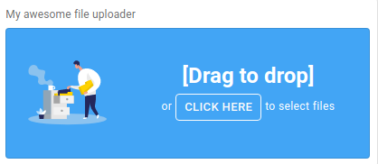

<p align="center"><a href="" target="_blank"></a></p>


<h1 align="center">🗃️ React Material Fileuploader</h1>
<p align="center">developed with <a target="_blank" href="https://mui.com">@mui v5</a> </p>

<p align="center">
  
  
  
  
</p>

---

React mui fileuploader is a react component based on @mui v5 that allows you to upload files with an awesome ui component.


## 🚀 Installation
```nodejs
  npm install react-mui-fileuploader
```

## 💻 Usage
```javascript
import React from 'react'
import ReactDOM from 'react-dom'
import FileUpload from "react-mui-fileuploader"

function App() {
  
  const handleFileUploadError = (error) => {
    // Do something...
  }
  
  const handleFilesChange = (files) => {
    // Do something...
  }

  return (
    <FileUpload
      multiFile={true}
      disabled={false}
      title="My awesome file uploader"
      header="[Drag to drop]"
      leftLabel="or"
      rightLabel="to select files"
      buttonLabel="click here"
      buttonRemoveLabel="Remove all"
      maxFileSize={10}
      maxUploadFiles={0}
      maxFilesContainerHeight={357}
      errorSizeMessage={'fill it or move it to use the default error message'}
      allowedExtensions={['jpg', 'jpeg']}
      onFilesChange={handleFilesChange}
      onError={handleFileUploadError}
      imageSrc={'path/to/custom/image'}
      bannerProps={{ elevation: 0, variant: "outlined" }}
      containerProps={{ elevation: 0, variant: "outlined" }}
    />
  )
}

ReactDOM.render(<App />, document.querySelector('#root'))

```


## 😁 Authors

- Muller Roufaou ([rouftom](http://github.com/rouftom))


## 🤔 FAQ

* __Where can I find more documentation?__

  This library is a marriage of [@mui](http://mui.com/getting-started/usage/) and a React setup created with [React](https://fr.reactjs.org/). Either one would be a great place to start!


## 🙇‍♂️ Extra

    Do you like this library ? Buy me a coffee or support me with a star on Github

<a href="https://www.buymeacoffee.com/Lnp9rkM" target="_blank"></a>

* Btc address: `bc1qettgagenn9nc8ks7ghntjfme96yvvkfhntk774`

* Eth address: `0xB0413d8D0336E263e289A915c383e152155881E0`


## License

### react-mui-fileuploader

MIT License

Copyright (c) 2022 rouftom

Permission is hereby granted, free of charge, to any person obtaining a copy
of this software and associated documentation files (the "Software"), to deal
in the Software without restriction, including without limitation the rights
to use, copy, modify, merge, publish, distribute, sublicense, and/or sell
copies of the Software, and to permit persons to whom the Software is
furnished to do so, subject to the following conditions:

The above copyright notice and this permission notice shall be included in all
copies or substantial portions of the Software.

THE SOFTWARE IS PROVIDED "AS IS", WITHOUT WARRANTY OF ANY KIND, EXPRESS OR
IMPLIED, INCLUDING BUT NOT LIMITED TO THE WARRANTIES OF MERCHANTABILITY,
FITNESS FOR A PARTICULAR PURPOSE AND NONINFRINGEMENT. IN NO EVENT SHALL THE
AUTHORS OR COPYRIGHT HOLDERS BE LIABLE FOR ANY CLAIM, DAMAGES OR OTHER
LIABILITY, WHETHER IN AN ACTION OF CONTRACT, TORT OR OTHERWISE, ARISING FROM,
OUT OF OR IN CONNECTION WITH THE SOFTWARE OR THE USE OR OTHER DEALINGS IN THE
SOFTWARE.
